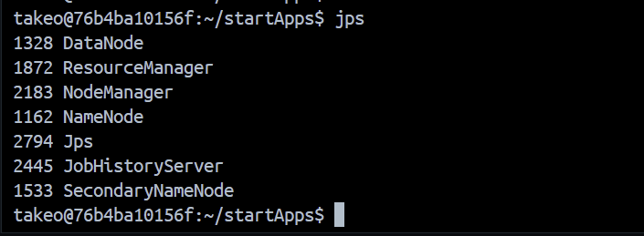
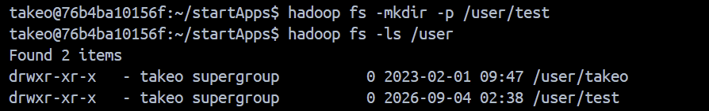
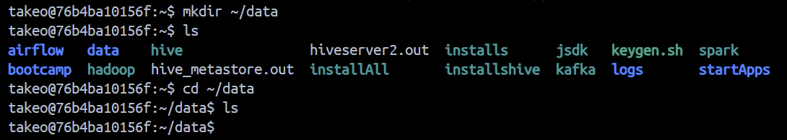
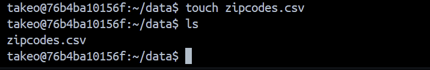
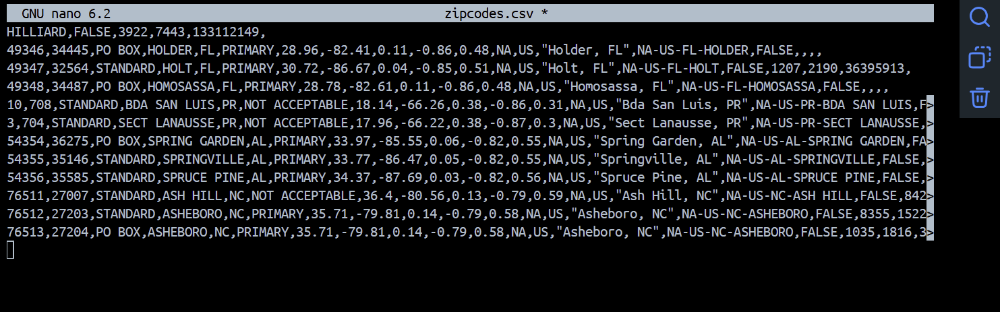
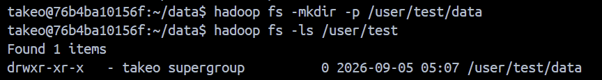
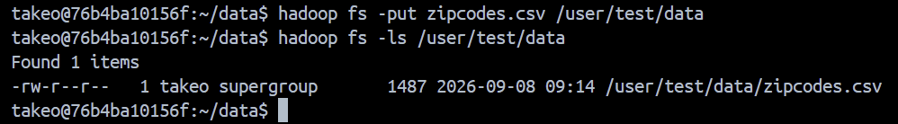
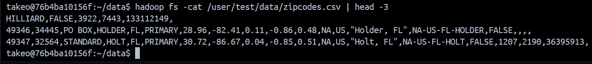

# Hadoop Environment Setup and HDFS Data Management

## Project Overview
This project demonstrates the setup and basic usage of a Hadoop
environment using Docker. It includes starting Hadoop services,
creating directories in HDFS, and working with data inside HDFS.

## Technologies Used
- Hadoop
- HDFS
- Docker
- Linux
- VS Code

## Project Steps
### Step 1: Set Up the Hadoop Environment
Started the Hadoop environment inside the Docker container to initialize the required Hadoop services and prepare the environment for HDFS operations.

### Step 2: Validate the Hadoop Environment
Verified the Hadoop environment by checking the active Java processes to ensure the required Hadoop services were running successfully.

### Step 3: Creatre an HDFS Directory
Created a directory in HDFS to provide a dedicated location for storing and managing project data. Also verifying its successful creation.

### Step 4: Prepare the local Data Directory
Created and accessed a local data directory inside the Docker container to prepare the dataset for upload to Hadoop File System (HDFS).

### Step 5: Create a Dataset File
Created the zipcodes.csv file in the local data directory to prepare the dataset for upload to HDFS.

### Step 6: Polulate the Dataset File
Populated the zipcodes.csv file with the ZIP code dataset to prepare the data for storage and management in HDFS.

### Step 7: Create the HDFS Data Directory
Created a dedicated directory within HDFS to organize and store the dataset.

### Step 8: Upload the Dataset to HDFS

Uploaded the zipcodes.csv dataset from the local Docker filesystem to the designated directory in HDFS.

### STEP 9: Inspect the Dataset in HDFS
Displayed the first 3 lines of the zipcodes.csv file directly from HDFS to verify that the uploaded dataset could be accessed successfully.

### Step 10: Download the Dataset from HDFS

Attempted to download the zipcodes.csv file from HDFS to the local Docker filesystem using the -get command. The command reported that the file already existed locally. The same command can be used on another computer with access to the Hadoop cluster to retrieve a local copy of the dataset.

## Conclusion
This project provided practical experience in setting up and working with Hadoop and HDFS in a Docker environment. It involved starting Hadoop services, creating and managing HDFS directories, preparing and uploading a dataset, viewing data stored in HDFS, and retrieving files back to the local filesystem. Overall, the project strengthened my understanding of Hadoop, HDFS, Docker, Linux commands, and basic data management.