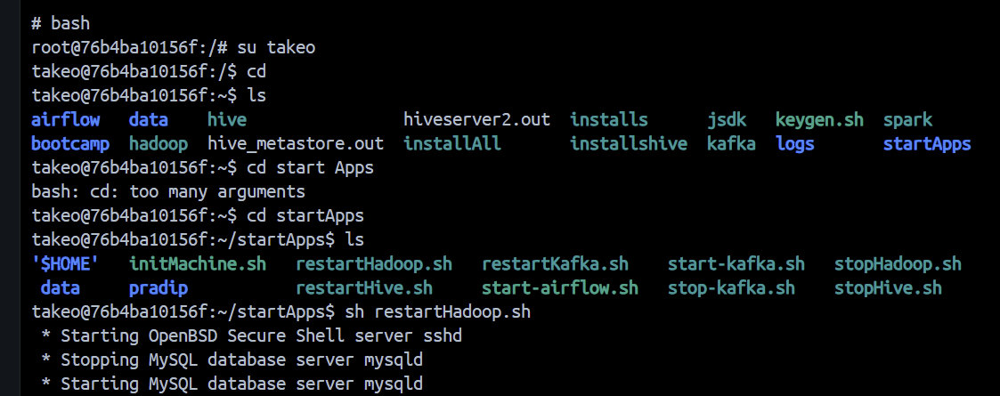

# Hadoop Environment Setup and HDFS Data Management

## Project Overview
This project demonstrates the setup and basic usage of a Hadoop
environment using Docker. It includes starting Hadoop services,
creating directories in HDFS, and working with data inside HDFS.

## Technologies Used
- Hadoop
- HDFS
- Docker
- Linux
- VS Code

## Project Steps
### Step 1: Set Up the Hadoop Environment
Started the Hadoop environment inside the Docker container to initialize the required Hadoop services and prepare the environment for HDFS operations.

